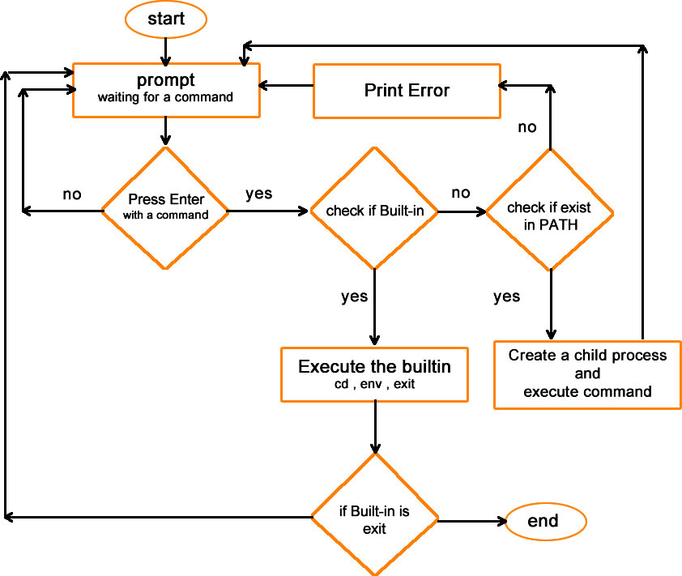

# CISHELL v1.0


### Description
CISHELL v1.0 is a basic UNIX command interpreter, that read, interprets, and execute a command if its exist

### Builtins
|command | INFORMATION |
| ------ | ------ |
| env | display environment variables |
| cd | change current directory |
| exit | terminate the shell |

### General Flowchart


# Requirements
### General
- Allowed editors: vi, vim, emacs
- All your files will be compiled on Ubuntu 14.04 LTS
- Your C programs and functions will be compiled with gcc 4.8.4 using the flags -Wall -Werror -Wextra and -pedantic
- All your files should end with a new line
- A README.md file, at the root of the folder of the project is mandatory
- Your code should use the Betty style. It will be checked using betty-style.pl and betty-doc.pl
- No more than 5 functions per file
- All your header files should be include guarded
- Use system calls only when you need to (why?)

### List of allowed functions and system calls

- access (man 2 access)
- chdir (man 2 chdir)
- close (man 2 close)
- closedir (man 3 closedir)
- execve (man 2 execve)
- exit (man 3 exit)
- _exit (man 2 _exit)
- fflush (man 3 fflush)
- fork (man 2 fork)
- free (man 3 free)
- getcwd (man 3 getcwd)
- getline (man 3 getline)
- isatty (man 3 isatty)
- kill (man 2 kill)
- malloc (man 3 malloc)
- open (man 2 open)
- opendir (man 3 opendir)
- perror (man 3 perror)
- read (man 2 read)
- readdir (man 3 readdir)
- signal (man 2 signal)
- stat (__xstat) (man 2 stat)
- lstat (__lxstat) (man 2 lstat)
- fstat (__fxstat) (man 2 fstat)
- strtok (man 3 strtok)
- wait (man 2 wait)
- waitpid (man 2 waitpid)
- wait3 (man 2 wait3)
- wait4 (man 2 wait4)
- write (man 2 write)

### Compilation

Your shell will be compiled this way:

```sh
gcc -Wall -Werror -Wextra -pedantic *.c -o hsh
```

### Testing

Your shell should work like this in interactive mode:

```sh
$ ./hsh
($) /bin/ls
hsh main.c shell.c
($)
($) exit
$
```

But also in non-interactive mode:

```sh
$ echo "/bin/ls" | ./hsh
hsh main.c shell.c test_ls_2
$
$ cat test_ls_2
/bin/ls
/bin/ls
$
$ cat test_ls_2 | ./hsh
hsh main.c shell.c test_ls_2
hsh main.c shell.c test_ls_2
$
```

### Examples
```sh
[CISHELL$]ls
hsh shell.c shell.h test_ls_2
[CISHELL$]
```

```sh
[CISHELL$]ls -l
-rwx-rwx -rwx 1 vagrant vagrant   200 nov 25 18:52 hsh
-rx--rw---rw- 1 vagrant vagrant  8210 nov 25 20:53 shell.h
-rx--rw---rw- 1 vagrant vagrant  8210 nov 25 20:53 shell.h
[CISHELL$]
```

```sh
[CISHELL$]pwd
/home/vagrant/simple_shell
[CISHELL$]
```
### Authors

> Carlos Andres Garcia Morales - @kargarmor
> Ivan Dario Lasso Gil - @ilasso 
